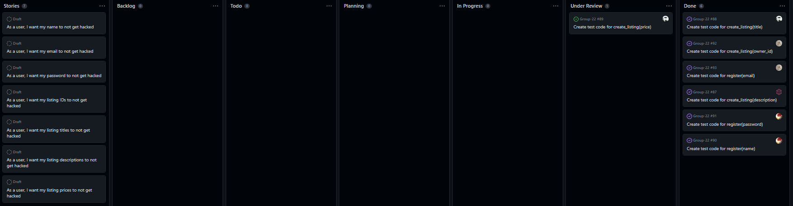

# Allen

### 1. what is the branch he/she worked on (has to be pushed to the repo).

test_update_user_profile

### 2. what is the progress so far (at least some test cases written, more than 2)

Completed requirements:
validating email, username and postal code. About 20 test cases.

### 3. any difficulties.

Being unable to write comments in the .in and .out files made it hard to annotate the test cases and make it clear.
Something in test_listing.py conflicted with the new test cases so the old code had to be changed.

### 4. what is the plan for the days before the deadline.

implement more test cases and improve the readme file

# Connor

### 1. what is the branch he/she worked on (has to be pushed to the repo).

`test_register_branch`

### 2. what is the progress so far (at least some test cases written, more than 2)

Wrote all test cases for R1-1 through R1-10 from sprint two. Used output testing, input partition testing, and input boundary testing.

### 3. any difficulties.

- Ran into issue where tests were not verifying due to an issue with \r at the end of lines.
- Also ran into issue where some tests are unintuitive to frontend testing, as they test things only backend can see.

### 4. what is the plan for the days before the deadline.

- Review other members' pull requests
-  create the markdown file that describes the file structure documentation

# Haiden

### 1. what is the branch he/she worked on (has to be pushed to the repo).

`test_login_page_haiden`

### 2. what is the progress so far (at least some test cases written, more than 2)

Wrote four test cases for R2-1. Used input partition testing.

### 3. any difficulties.

- I ran into issues with duplicate lines when creating the output file.
- I changed the email for the test user in the test code and forgot to change it in the test input file.

### 4. what is the plan for the days before the deadline.

- Make test cases for R2-2.
- Make test cases for the update listing page.
- Make a `README.md` file explaining my chosen test cases.
- Make pull request for testing user login.
- Make pull request for testing update listing.
- Review assigned pull requests.

# Kennan

### 1. what is the branch he/she worked on (has to be pushed to the repo).
- `Test_Create_Listing_Page`

### 2. what is the progress so far (at least some test cases written, more than 2)
- Have written functioning test cases for R4-2, R4-3, and R4-5 from Sprint-2. Thus far have used Input Boundary Testing and Output Partition Testing.

### 3. any difficulties.
- Ran into some difficulties while manually constructing the `*.in` and `*.out` files (had some duplicate/missing lines).
- Encountered some confusion regarding certain test methods, as not all CLI errors are explicit as to what the true error was (eg. just saying "Failed to create listing", but not saying *why*)
- Had some issues with GitHub itself slowly dying as we were using it (they appear to be having widespread outages)

### 4. what is the plan for the days before the deadline.
- Write the remaining R4 test cases from Sprint-2
- Properly fill out (and improve formatting) of `README.md` file in test directory (explains which parts of `*.in` file test what, and the reasoning behind it)
- Create PR and review other's PRs

