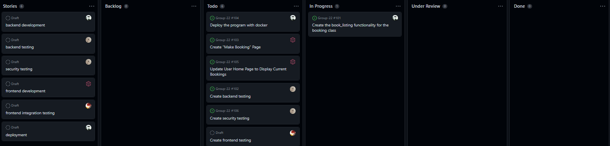

# Update Report Made: Nov.21.2022
---

# Allen

### 1. what is the branch he/she worked on (has to be pushed to the repo).
None yet, planning on creating one called "booking_frontend_testing"

### 2. what is the progress so far (at least some test cases written, more than 2)
None yet

### 3. any difficulties.
None yet

### 4. what is the plan for the days before the deadline.
Wait for frontend development to finish then start working on frontend testing

# Connor

### 1. what is the branch he/she worked on (has to be pushed to the repo).

`booking_backend`

### 2. what is the progress so far (at least some test cases written, more than 2)

created and assigned cards on the scrumboard, created the book_listing function, need to finish it and merge it

### 3. any difficulties.

not at the moment, but they may arise if a group member notices something on the pull request

### 4. what is the plan for the days before the deadline.

finish the book_listing function, merge it, wait for the other components to finish, then deploy it all with docker

# Haiden

### 1. what is the branch he/she worked on (has to be pushed to the repo).

N/A

Planned Branches:

`backend_testing_haiden`

`security_testing_haiden`

### 2. what is the progress so far (at least some test cases written, more than 2)

- Created cards on scrum board
- Created requirements

### Requirements:

r1: A user can book a listing.

r2: A user cannot book a listing for his/her listing.

r3: A user cannot book a listing that costs more than his/her balance.

r4: A user cannot book a listing that is already booked with the overlapped dates.

r5: A booked listing will show up on the user's home page.

r6: User id exists in the database

r7: Listing id exists in the database

r8: Price has to be of range [10, 10000].

r9: Date must be after 2021-01-02 and before 2025-01-02

r10: User balance is correctly updated upon successful booking

### 3. any difficulties.

N/A

### 4. what is the plan for the days before the deadline.

- Create backend test cases
- Create security test cases
- Attend second scrum meeting

# Kennan

### 1. what is the branch he/she worked on (has to be pushed to the repo).
None Yet; planning on creating `Make_Booking_Page` and `Bookings_On_Home_Page`.

### 2. what is the progress so far (at least some test cases written, more than 2)
None Yet

### 3. any difficulties.
None Yet

### 4. what is the plan for the days before the deadline.
Wait for backend development to be completed, then begin working on the Create Booking Page. Once that is complete, begin working on the Display Bookings on Home Page functionality.

