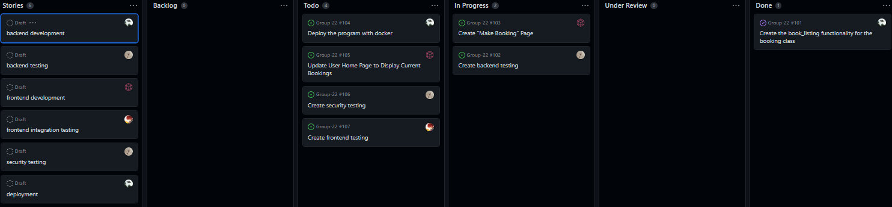

# Allen

### 1. what is the branch he/she worked on (has to be pushed to the repo).

### 2. what is the progress so far (at least some test cases written, more than 2)

### 3. any difficulties.

### 4. what is the plan for the days before the deadline.

# Connor

### 1. what is the branch he/she worked on (has to be pushed to the repo).

### 2. what is the progress so far (at least some test cases written, more than 2)

### 3. any difficulties.

### 4. what is the plan for the days before the deadline.

# Haiden

### 1. what is the branch he/she worked on (has to be pushed to the repo).

### 2. what is the progress so far (at least some test cases written, more than 2)

### 3. any difficulties.

### 4. what is the plan for the days before the deadline.

# Kennan

### 1. what is the branch he/she worked on (has to be pushed to the repo).

### 2. what is the progress so far (at least some test cases written, more than 2)

### 3. any difficulties.

### 4. what is the plan for the days before the deadline.

