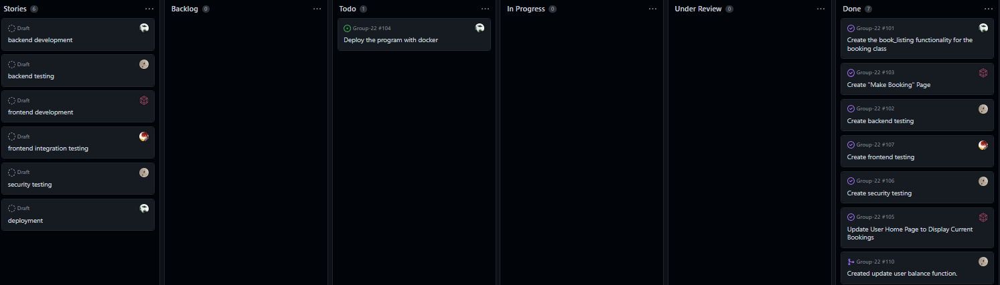

# Update Report Made: Dec.3.2022
---

# Allen

### 1. What is the branch he/she worked on (has to be pushed to the repo)
test_booking_frontend

### 2. What is the progress so far
Finished all testing and merged the branch already

### 3. Any difficulties
There was a few bugs that had to be fixed

### 4. What is the plan for the days before the deadline.
N/A

# Connor

### 1. What is the branch he/she worked on (has to be pushed to the repo)

`booking_backend` `booking_backend_bugfix`

### 2. What is the progress so far

created and assigned cards on the scrumboard, created the book_listing function, made changes so that it fits the criteria, merged other pull requests, updated readme.

### 3. Any difficulties

Some of the requirements were misinterpreted and the booking had to be changed to fix them after we noticed

### 4. What is the plan for the days before the deadline.

Wait for the other components to finish and then deploy it all with docker. Waiting until sprint 5 grades have returned so that we know we did it correctly last time.

# Haiden

### 1. What is the branch he/she worked on (has to be pushed to the repo)

`backend_testing_haiden`

`security_testing_haiden`

### 2. What is the progress so far

- Created cards on scrum board
- Created requirements
- Created backend test cases for the `book_listing()` function
- Created database security test cases for the `book_listing()` function

**Requirements:**

- R1: A user can book a listing.
- R2: A user cannot book a listing for his/her listing.
- R3: A user cannot book a listing that costs more than his/her balance.
- R4: A user cannot book a listing that is already booked with the overlapped dates.
- R5: A booked listing will show up on the user's home page.
- R6: User id exists in the database
- R7: Listing id exists in the database
- R8: Price has to be of range [10, 10000].
- R9: Date must be after 2021-01-02 and before 2025-01-02
- R10: User balance is correctly updated upon successful booking

### 3. Any difficulties

Getting error `sqlite3.OperationalError: database is locked` when running pytest.

Error occurs when attempting to create a second booking.

#### The above difficulties have now been resolved.

### 4. What is the plan for the days before the deadline.

- Review remaining pull requests.

# Kennan

### 1. What is the branch he/she worked on (has to be pushed to the repo)
`Make_Booking_Page`, `Home_Page_List_Bookings`

### 2. What is the progress so far
- Created and assigned cards on scrum board
- Created and merged "Make Booking Page" functionality & fixed tests. (Accessible through the user home page)
	- `Make_Booking_Page` branch
- Created and merged functionality to the user home page to display the user's bookings.
	- `Home_Page_List_Bookings` branch

### 3. Any difficulties
- An exception was thrown when attempting to book listing (backend bug was fixed in `booking_backend_bugfix` branch)
- Only one booking could ever be created (fixed by removing the `unique` property for some IDs)

### 4. What is the plan for the days before the deadline.
1. Review any remaining PRs

